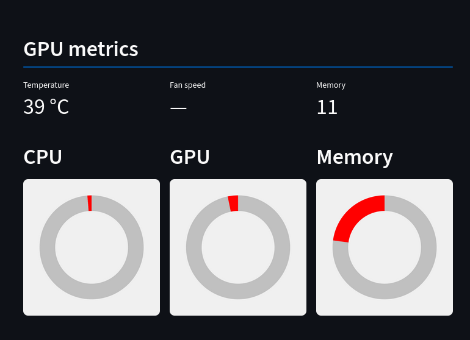

# Laida

Based on data from [glances](https://github.com/nicolargo/glances?tab=readme-ov-file) this package provides a [Streamlit](https://streamlit.io/) UI for small displays.

The idea is to provide linux users something similar to Aida64 dashboards (long term goal :-)).
